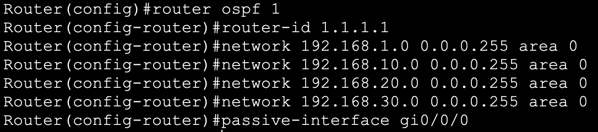
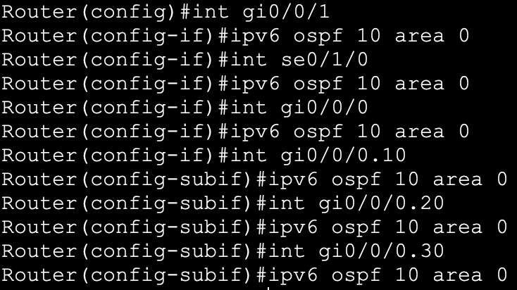
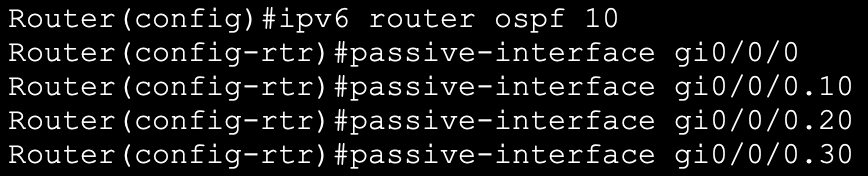

**2. Connecting two Branch Offices
with static routes & dynamic routing protocols (OSPFv2, OSPFv3, EIGRP,
EIGRPv6, BGP) + NAT/PAT**

<u>Description</u>

 

In this lab, I will use
NAT, dynamic routing protocols and static routes to connect the two
sites (Building A & Building B) together.  
  

Building A uses the
following addressing scheme 

  
And Building B uses this addressing scheme  
  
  
  

Firstly, I have prepared
the following ip addressing scheme in IPv4 and IPv6 for the links
between the routers, and assigned each interface with the corresponding
configuration

** **

****

** **

1.  **NAT/PAT**

** **

Interfaces were
configured with an IPv4 and IPv6 address matching the physical network
diagram previously presented

****

****

Next, I created ACLs for
the two sites, which I will later use for
PAT

After that, the inside &
outside interfaces were
configured

 

Lastly, I will use the
inside global address from the interface Gi0/0/1 on each router to
complete the PAT configuration 

 

With that, ip hosts with
private ip addresses in the above subnets can now reach other hosts on
the internet.

 

 

Next, I will configure a
static mapping between the inside local address 172.16.10.100 of an HTTP
server set up within subnet 172.16.10.0/24 to the inside global address
200.0.10.100, so that it can be reachable from other hosts on the
internet

 

 

Since the inside and
outside interfaces have already been configured, we can now check the
connectivity, trying to reach the HTTP server from PC F in subnet
192.168.30.0/24 

 

 

2.  **OSPFv2 & OSPFv3
    **

 

**2.1. OSPFv2 Configuration**

 

OSPFv2 has been enabled
on the following interfaces and subinterfaces using a single area
design. 

The interfaces facing
the private network were configured as passive-interfaces to reduce the
CPU overhead and bandwidth.

 

The other 2 WAN
interfaces have been configured using the newer interface configuration,
and the rest of the routers in area 0 were configured in a similar
manner  
 

 

The point to point
ethernet interfaces have been configured with the appropriate network
type to reduce the CPU overhead and convergence time

 

 

Next, I will change the
default reference bandwidth across all routers in area 0 to future proof
the design for a potential bandwidth upgrade to 10Gbps
  
  
Next, I will create a static default route on the edge router  
  

  
  
And enable the advertisement of default route information across the
OSPF enabled routers  
  

 

With that, we now have
dynamic entries into the OSPF routing table of RID 1.1.1.1 and a newly
learnt default route

 

 

Lastly, a ping has been
issued from PC E in VLAN 20 to the newly learnt route to 200.0.5.1 - the
ip address of one of the OSPF router interfaces.

 

**2.2. OSPFv3 Configuration**

 

Now that IPv4 routes
have been shared across the routers successfully, I will enable OSPFv3,
starting with configuring link-local addresses across area 0.

 

And repeat the process
across all the other routers for the following topology

 

Next, I will enable
OSPFv3 for each router interface within the topology. Because I use an
earlier version of IOS in Packet Tracer, I need to configure the routers
with the legacy commands “ipv6 router ospf”, “ipv6 ospf {process-id}
area {area-id}...etc. 

 

After identifying the
interfaces that will enable OSPFv3, I will manually assign router IDs to
each router in the topology

 

 

Change the network type
to point-to-point for the ethernet interfaces

 

  
And configure the passive interfaces 

 

Next, I will configure a
static default route on the edge router

 

 

And enable the
advertisement of default route information across the OSPFv3 enabled
routers

 

 

With that, we now have
IPv6 routes and a new default route 

 

And a ping was issued
from PC D in VLAN 10 to 2001:1234:5678:9BBB::1, the IPv6 address on
Router 11 GigabitEthernet Interface to test the connectivity  
  

 

3.  **EIGRPv4 &
    EIGRPv6**

** **

**3.1 EIGRPv4 Configuration**

** **

 

I will start the
configuration by creating the EIGRP process and defining the interfaces
which will enable EIGRP on each router, starting with Router 1

 

The same configuration
with the appropriate parameters has been applied across the rest of the
routers. 

 

Next, I will configure
the passive-interfaces 

 

 

Configure a static
default route on the edge router  
  

  
  
And enable the redistribution of the recently configured static default
route across the EIGRPv4 enabled routers  
  
  
  
With that, we now have newly learnt IP routes in our routing table,
including a default route 

 

 

And we can issue a ping
to 200.0.7.1/24 from PC A’s 172.16.10.7/24

 

 

**3.2 EIGRPv6 Configuration**

 

Firstly, I will create
the EIGRPv6 process, assign router IDs and enable EIGRP with the “no
shutdown” command across the routers, starting with router 0

 

 

Next, I will configure
the interfaces for EIGRPv6

 

And select which
interfaces will act as passive interfaces

 

 

Configure a static
default route on the edge router  
  
  
  
And enable the redistribution of the recently configured static default
route across the EIGRPv6 enabled routers  
  

 

With that, we now have
newly learnt IPv6 routes in our routing table, including a default route

 

 

 

Lastly, I will send a
ping from PC F in VLAN 30 to 2001:1234:5678:9BBC::1 - the IPv6 address
of one of the routers interfaces

 

 

 

 

 

4.  **eBGP**

 

Now that the OSPF and
EIGRP networks have been configured and the routes learnt by every
device in each topology, I will connect the two together using
eBGP.

 

The following ip
addressing scheme and AS numbers assignment has been applied

 

 

 

I will start by
configuring the edge routers to enable BGP for AS 65100 and AS 65200,
and specify the neighbours on each router

 

 

Next, I will enable the
routers to exchange prefixes, starting with the OSPF routers

Then the EIGRP routers

  
  

With that, both OSPF and
EIGRP routes show up the routing tables of the BGP enabled routers

 

And a ping from PC I in
AS 65100 was sent to check connectivity with Router 0(1) in AS
65200

 

 

 
