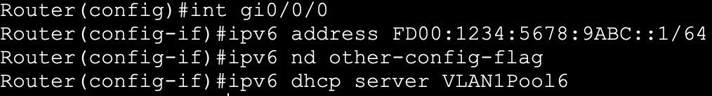
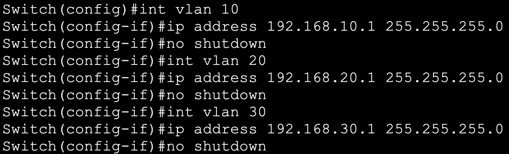

**1. Inter-Vlan Connectivity,
EtherChannels & DHCP servers (internal & external)**

** **

<u>Description</u>

 

I will start this lab by
adding 3 PCs to each of the 3 Layer 2 switches in the topology.

 

<u></u>

 

I then created and named
the 3 corresponding VLANs: Sales, Engineering and Refunds

 

 

And decided on the
following assignment of PCs / VLAN & Subnet / VLAN

 

Next, I designated the
above PCs to their corresponding VLANs and configured the switch ports
to act in unconditional access mode.

 

 

The above commands have
been replicated accordingly on the other 2 switches in the topology.

 

Next I will configure
Layer 2 EtherChannels between the 3 switches for improved redundancy and
to reduce STP convergence time in the event of a link failure. I will
use static mode, PAgP and LACP.

 

●     Static Layer 2 EtherChannel

 

The following
configuration has been applied on both ends on the link between the
first group of switches.

 

 

Following the addition
of the port channel, trunking was enabled, and the corresponding VLANs
have been allowed on the trunk

 

 

●     PAgP EtherChannel

 

The following
configuration has been applied on the first of the two switches in the
second group.

 

 

The second switch has
been configured to initiate the negotiation and form the etherchannel  
  

 

Both switches have been
added the previous configuration to allow traffic from VLAN 10, 20 and
30, and the native VLAN

 

●     LACP EtherChannel

 

The first of the two
switches in the third group have been configured as such:

 

 

With the switch on the
other end being configured as:  
  

 

Now that the two ports
on both ends of the link have been configured as an etherchannel, the
trunk formed, and the VLANs have been allowed on the trunk, I will
configure the sub-interfaces on the router. 

 

Starting with the
Gi0/0/0.10 subinterface configuration and static ip address assignment

 

Second subinterface for
VLAN 20

 

And the third for VLAN
30

 

 

Lastly, I will configure
the physical interface with an IP address and a subnet mask to allow the
native VLAN traffic through. 

 

 

 

Next I will configure
the router to act as the DHCP server.

 

To do so, I started by
defining the pools and the default router, and the DNS server for each
VLAN

 

Then I added the “ip
helper-address” command on the subinterfaces corresponding to each
VLAN

 

 

 

 

Now that DHCP is active,
the PCs in the topology can automatically get their configuration

 

 

To test the
configuration done so far I issued a ping from PC A in VLAN 10 to PC E
in VLAN 20

 

 

After that, I have
enabled ipv6 on the router and created ipv6 DHCP pools for each VLAN
using unique local addresses

 

  
Then, I configured the physical interface  
  

 

And the three
subinterfaces

 

 

With that, PC A now has
both an IPv4 and an IPv6 configuration from the DHCP server

 

 

And pinging PC E in VLAN
20 using the ipv6 address works as intended  
  

 

●     Inter-Vlan Connectivity with
SVI & External DHCP Server

 

For simplicity sake, I
copied the topology and maintained the same IP addressing scheme, but
this time I will use a multilayer switch and create SVIs 

 

I’ll start enabling
routing using the “Ip routing” command, create the VLAN interfaces and
assign IP addresses and masks for each

 

 

I then configured the
link between the Layer 2 and the Layer 3 Switch as a trunk and allowed
the corresponding VLANs through

 

 

The DHCP server has been
statically configured with the IP address 192.168.1.2 and the mask
255.255.255.0

 

 

4 pools have been
created within the external DHCP server configuration

 

 

And lastly, the
ip-helper command was issued within each SVI, pointing at the ip 
address of the DHCP server

 

 

To check that the
configuration works, I issued a ping from PC A (1) in VLAN 10 to PC E
(1) in VLAN 20.

 

 

To connect the two sites
together, I prepared a different lab in which I will configure static &
dynamic routing using OSPFv2, OSPFv3, EIGRP, EIGRPv6, and eBGP  
  
The second site which was originally configured with switched virtual
interfaces and the same ip addressing scheme is now using a router as
the default gateway and the following ip addressing scheme  
  

 

Follow this
[link](https://github.com/ConstantinAlexandruOneata/NetworkingProjects/blob/main/Connecting%20two%20Branch%20Offices%20with%20static%20routes%20%26%20dynamic%20routing%20protocols%20(OSPFv2%2C%20OSPFv3%2C%20EIGRP%2C%20EIGRPv6%2C%20BGP)%20%2B%20NAT%5CPAT.md) to see the next project

 
