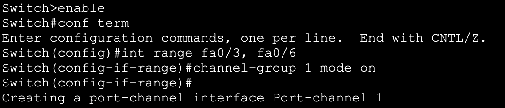

<h1>Inter-Vlan Connectivity, EtherChannels & DHCP </h1>

<h2>Description</h2>

This project involves configuring inter-VLAN connectivity, setting up EtherChannels for redundancy, and implementing DHCP servers for dynamic IP address allocation. It also includes enabling IPv6 and ensuring seamless inter-VLAN communication.

I will start this lab by adding 3 PCs to each of the 3 Layer 2 switches in the topology. 

</u>

 

I then created and named the 3 corresponding VLANs: Sales, Engineering and Refunds

And decided on the
following assignment of PCs / VLAN & Subnet / VLAN

Next, I designated the above PCs to their corresponding VLANs and configured the switch ports
to act in unconditional access mode.

The above commands have
been replicated accordingly on the other 2 switches in the topology.

 Next, I will configure Layer 2 EtherChannels between the 3 switches for improved redundancy and to reduce STP convergence time in the event of a link failure. I will use static mode, PAgP and LACP.

<h4>➤ Static Layer 2 EtherChannel </h4>

The following configuration has been applied on both ends on the link between the
first group of switches.

Following the addition of the port channel, trunking was enabled, and the corresponding VLANs
have been allowed on the trunk

<h4>➤ PAgP EtherChannel</h4>

The following configuration has been applied on the first of the two switches in the
second group.

 And the second switch has been configured to initiate the negotiation and form the etherchannel. 

 After that, both switches have been added the previous configuration to allow traffic from VLAN 10, 20 and
30, and the native VLAN. 

<h4>➤ LACP EtherChannel</h4>

The first of the two switches in the third group have been configured as such:

With the switch on the other end being configured as:  

<h4>➤ Inter-Vlan Connectivity with Sub-interfaces </h4>

Now that the two ports on both ends of the link have been configured as an etherchannel, the trunk formed, and the VLANs have been allowed on the trunk, I will
configure the sub-interfaces on the router. 

Starting with the Gi0/0/0.10 subinterface configuration and static ip address assignment 

Second subinterface for VLAN 20

And the third for VLAN 30

Lastly, I will configure the physical interface with an IP address and a subnet mask to allow the native VLAN traffic through. 

Next, I will configure the router to act as the DHCP server. To do so, I started by defining the pools, the default router, and the DNS server for each
VLAN 

Then I added the “ip helper-address” command on the subinterfaces corresponding to each
VLAN

 Now that DHCP is active, the PCs in the topology can automatically get their configuration

To test the configuration done so far I issued a ping from PC A in VLAN 10 to PC E in VLAN 20

After that, I have enabled IPv6 on the router and created IPv6 DHCP pools for each VLAN
using unique local addresses

 Then, I configured the physical interface 

 And the three subinterfaces

With that, PC A now has both an IPv4 and an IPv6 configuration from the DHCP server

And pinging PC E in VLAN 20 using the IPv6 address works as intended 

<h4>➤ Inter-Vlan Connectivity with SVI </h4>

 For simplicity sake, I copied the topology and maintained the same IP addressing scheme, but this time I will use a multilayer switch and create SVIs 

 I’ll start enabling routing using the “Ip routing” command, create the VLAN interfaces and assign IP addresses and masks for each

 I then configured the link between the Layer 2 and the Layer 3 Switch as a trunk and allowed the corresponding VLANs through

 The DHCP server has been statically configured with the IP address 192.168.1.2 and the mask 255.255.255.0 

 4 pools have been created within the DHCP server configuration 

 And lastly, the ip-helper command was issued within each SVI, pointing at the ip  address of the DHCP server

 To check that the configuration works, I issued a ping from PC A (1) in VLAN 10 to PC E (1) in VLAN 20.

 To connect the two sites together, I prepared a different lab in which I will configure static & dynamic routing using OSPFv2, OSPFv3, EIGRPv4, EIGRPv6, and eBGP  

  

 The second site which was originally configured with switched virtual interfaces and the same ip addressing scheme is now using a router as
the default gateway and the following ip addressing scheme 

  

Follow this
[link](https://github.com/ConstantinAlexandruOneata/NetworkingProjects/blob/main/Connecting%20two%20Branch%20Offices%20with%20static%20routes%20%26%20dynamic%20routing%20protocols%20(OSPFv2%2C%20OSPFv3%2C%20EIGRP%2C%20EIGRPv6%2C%20BGP)%20%2B%20NAT%5CPAT.md) to see the next project
