<h1> Routing redundancy & Security using HSRP, DHCP Snooping, DAI, Port Security and ACL</h1>

<h2> Description </h2>

This lab builds on the previous topology presented in <a href="https://github.com/ConstantinAlexandruOneata/NetworkingProjects/blob/main/Connecting%20two%20Branch%20Offices%20with%20static%20routes%20%26%20dynamic%20routing%20protocols%20(OSPFv2%2C%20OSPFv3%2C%20EIGRP%2C%20EIGRPv6%2C%20BGP)%20%2B%20NAT%5CPAT.md" title="Connecting two Branch Offices with static routes & dynamic routing protocols (OSPFv2, OSPFv3, EIGRPv4, EIGRPv6 & eBGP) + NAT/PAT">“Connecting two Branch Offices with static routes & dynamic routing protocols (OSPFv2, OSPFv3, EIGRP, EIGRPv6, BGP) + NAT/PAT”</a>. The project enhances network resilience and security through the implementation of HSRP for redundancy, DHCP Snooping to prevent rogue DHCP servers, Dynamic ARP Inspection to mitigate ARP spoofing, Port Security to restrict unauthorized devices, and ACLs for traffic filtering and access control.

<h4> ➤ HSRP - Hot Standby Router Protocol</h4>

 The following IP addressing scheme was selected for the router interfaces

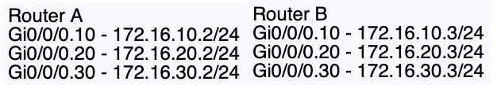

 I will now define the HSRP instances, the virtual IP addresses for both routers, and enable preemption, starting with Router A

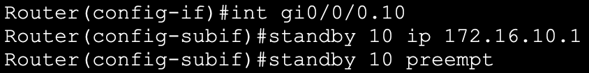

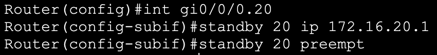

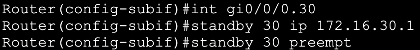

 After repeating the process on Router B, I will change the priority for the instances 10 and 30 on Router A to 105 so that router A will become the active router for VLAN 10 and VLAN 30, and so that I can balance the traffic between the two Routers

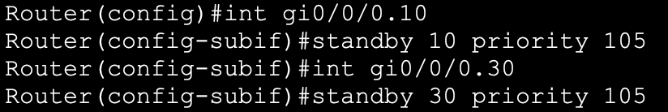

 Next, I will issue the following show command to check the configuration on Router A 

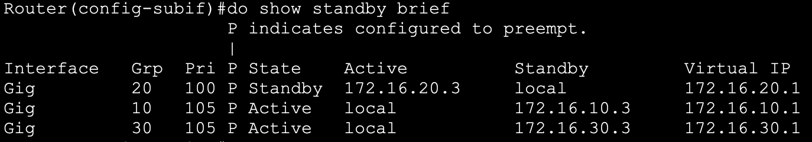

 Then, I will use a shutdown command on the sub-interface gi0/0/0.20 on Router B (the active
router for VLAN 20) 

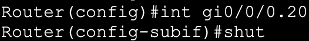

 Now that Router B’s interface is down, I used the same show command to check if the failover mechanism works as expected 

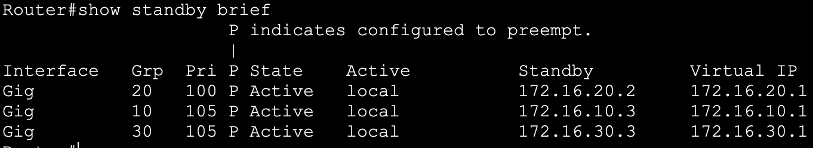

<h4>➤ DHCP Snooping</h4>

 The following switches will be configured for DHCP Snooping, DAI and Port Security 

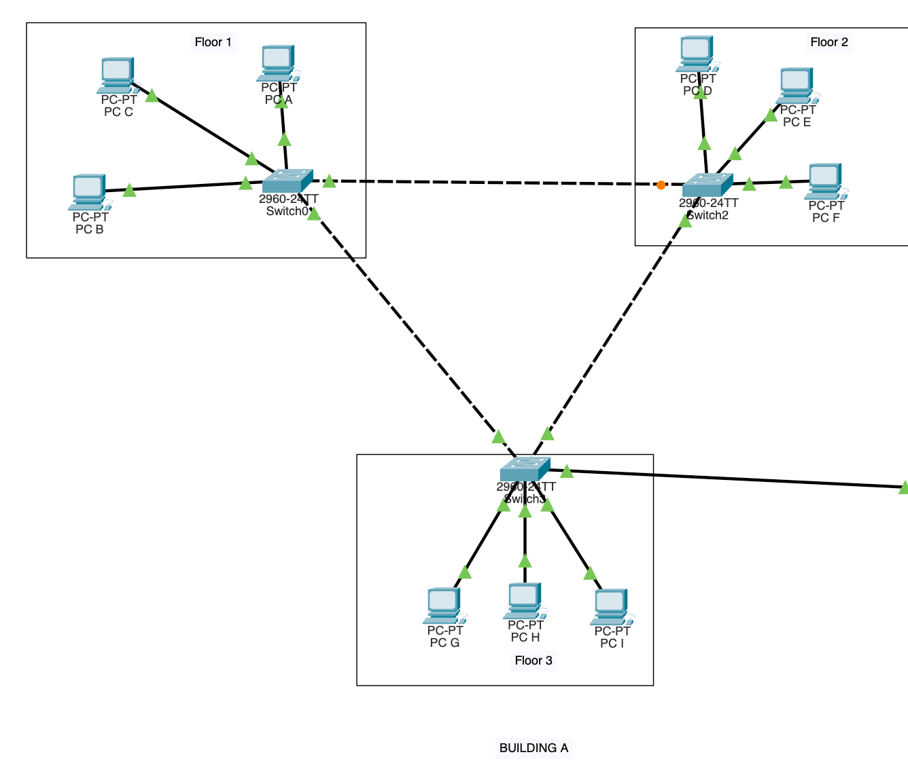

 And will use the following VLAN & IP addressing scheme

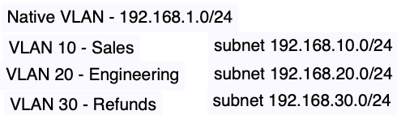

 First, I will enable DHCP snooping for each VLAN, and disable the information option

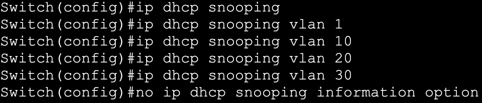

 After the configuration has been replicated across the other two switches, I will now designate the trusted interfaces on each switch 

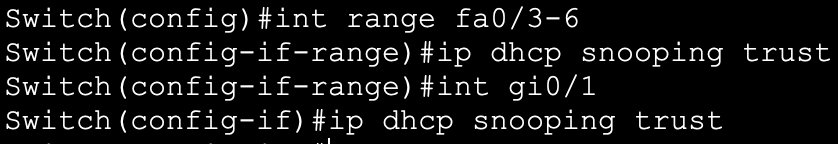

 And check the configuration 

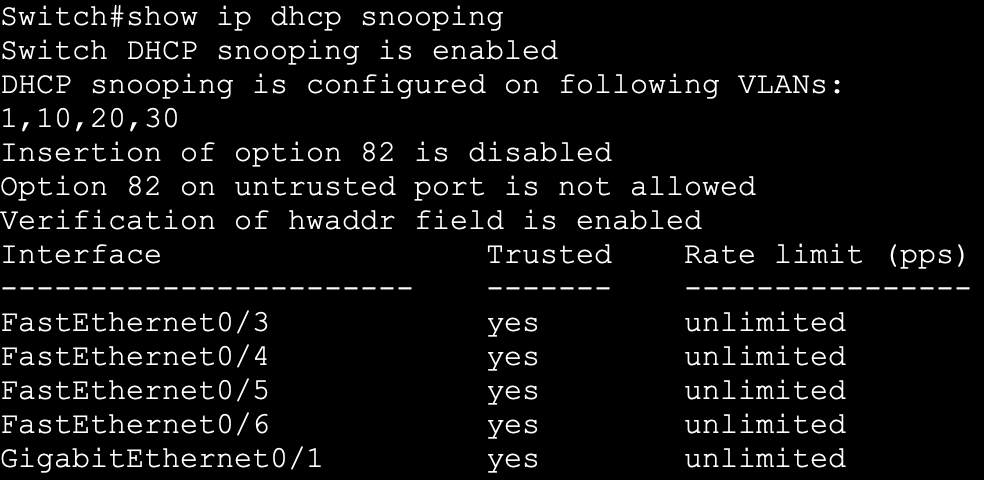

<h4>➤ DAI - Dynamic ARP Inspection </h4>

 Continuing from the previous configuration of DHCP Snooping, I will now enable DAI for every VLAN 

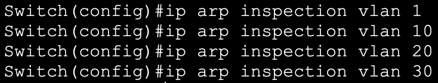

 And configure the trusted interfaces

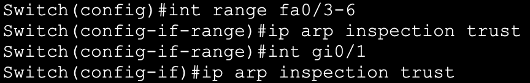

 Then, I will enable additional message checks 

 And verify the configuration using the following show command 

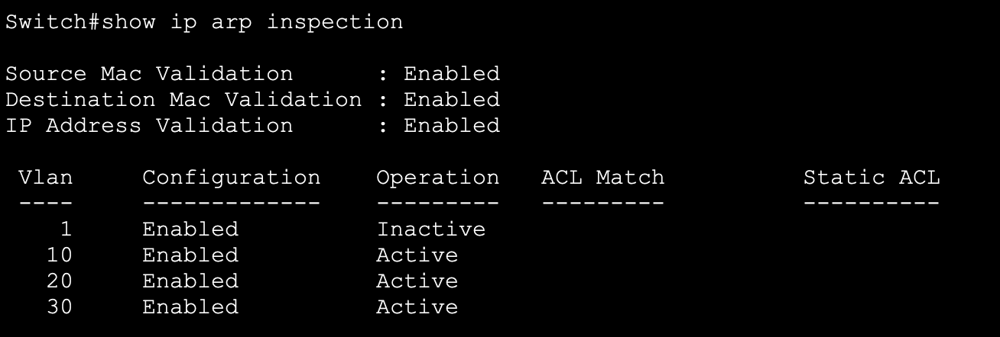

<h4>➤ Port Security </h4>

 Having already configured each port as either static access or trunk, I will now enable port security on the switches interfaces

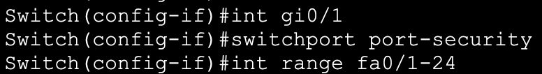

 Since Packet Tracer doesn’t allow err-recovery, I will change the violation mode to restrict, so that the interface will stay up if a violation
occurs

 Then, I will change the default maximum number of mac addresses allowed per interface to 20 for each interface that connects to another switch. I will also enable
dynamic learning of mac addresses through “switchport port-security mac-address sticky”. 

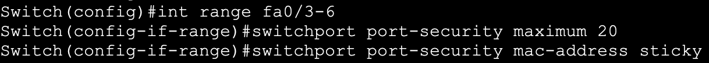

 Next, I will manually configure the interface gi0/1 of Switch 3 that connects to Router 0 with Router 0’s MAC address. 

 Lastly, I will check the configuration with the following show commands 

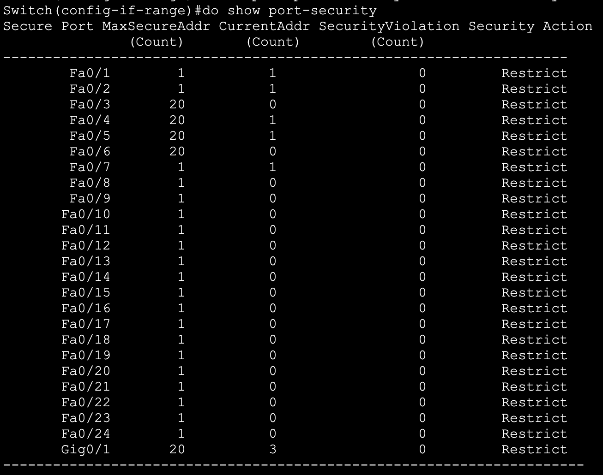

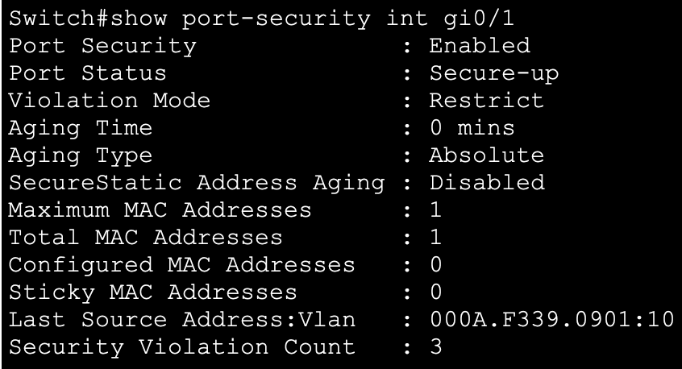

<h4>➤ ACL - Access Control Lists </h4>

 For this section I will create 3 access lists in total - 2 extended ACLs and 1 standard, defining multiple access control entries and implementing the lists for
different purposes. 

 Starting with an extended named ACL with sequencing numbers, I will first define the ACL on Router 0 - the default gateway from the previous topology 

 Then, I will create a statement to deny access to the web server 200.0.10.100 from host 192.168.30.4 in VLAN 30 

 After that, I will allow other hosts in VLAN 30 to access the same web server 

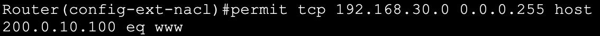

 Deny telnet connection attempts from addresses starting with 192.168.x.x and going to any hosts, but allow the same addresses to connect to any hosts using SSH
instead 

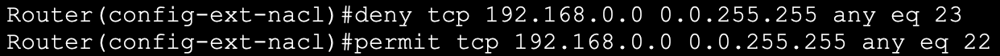

 Lastly, I will override the default implicit deny.

 Next, I will check the ACL just created 

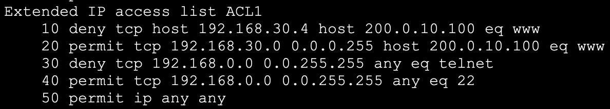

 I will remove statement 30

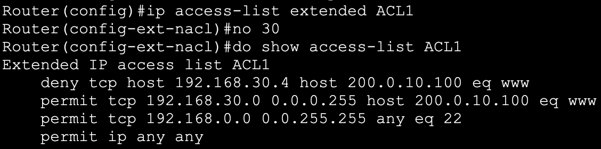

 And choose the interfaces and the direction in which the ACL will filter the traffic 

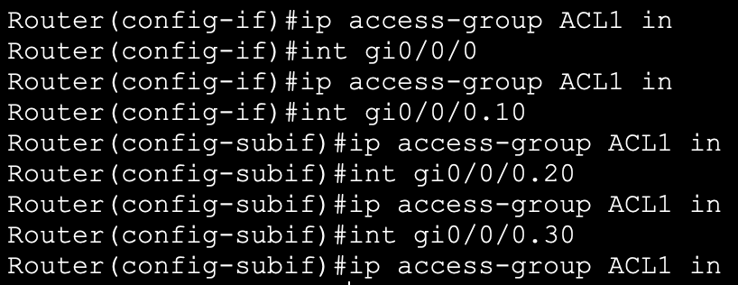

 To verify the operations of this newly created ACL I tried to connect to the HTTP server using the web browser of PC F, and received the following error 

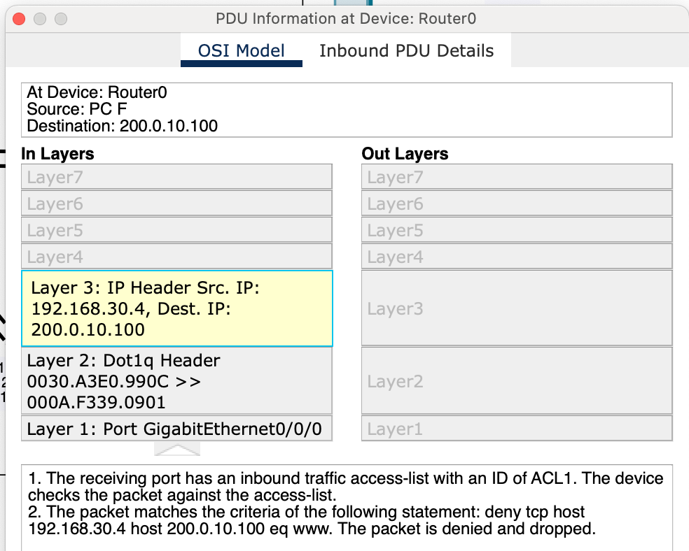

 Next, I will create a simple standard ACL and allow two internet hosts terminal access into Router 0 

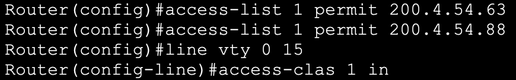

 I will now create a different extended ACL which will filter inbound traffic on Router 0’s WAN interfaces 

 Deny any telnet connection attempts into our network

 And permit SSH sessions from a subset of trusted hosts

 I will then give SNMP access to the same subset of hosts, and deny any other attempts to establish an SNMP session from unauthorised hosts 

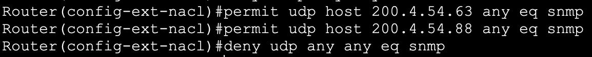

 Lastly I will override the default implicit deny and configure the interfaces and the direction for this ACL

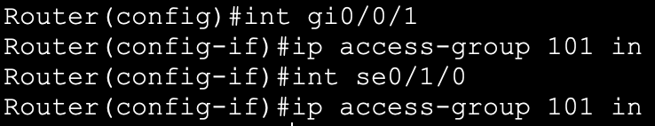
