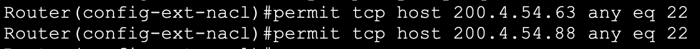

**Routing redundancy &
Security using HSRP, DHCP Snooping, DAI, Port Security and ACL**

** **

<u>Description</u>

 

I will start this lab by
adding a second router to building B from the previous topology
presented in [“Connecting two Branch Offices with
static routes & dynamic routing protocols (OSPFv2, OSPFv3, EIGRP,
EIGRPv6, BGP) + NAT/PAT”](https://github.com/ConstantinAlexandruOneata/NetworkingProjects/blob/main/Connecting%20two%20Branch%20Offices%20with%20static%20routes%20%26%20dynamic%20routing%20protocols%20(OSPFv2%2C%20OSPFv3%2C%20EIGRP%2C%20EIGRPv6%2C%20BGP)%20%2B%20NAT%5CPAT.md)  
  

1.  **HSRP - Hot Standby
    Router Protocol**

** **

The following ip
addressing scheme was selected for the router interfaces

I will now define the
HSRP instances, the virtual IP addresses for both routers, and enable
preemption, starting with Router A

 

 

After repeating the
process on Router B, I will change the priority for the instances 10 and
30 on Router A to 105 so that router A will become the active router for
VLAN 10 and VLAN 30, and so that I can balance the traffic between the
two Routers

 

 

Next, I will issue the
following show command to check the configuration on Router A  
  

 

Then, I will use a
shutdown command on the sub-interface gi0/0/0.20 on Router B (the active
router for VLAN 20)  
  

 

Now that Router B’s
interface is down, I used the same show command to check if the failover
mechanism works as expected  
  

 

2.  **DHCP
    Snooping**

 

The following switches
will be configured for DHCP Snooping, DAI and Port Security 

And will use the
following VLAN & IP addressing scheme

 

 

First, I will enable
DHCP snooping for each VLAN, and disable the information option

 

 

After the configuration
has been replicated across the other two switches, I will now designate
the trusted interfaces on each switch 

 

And check the
configuration 

3.  **DAI - Dynamic ARP
    Inspection **

 

Continuing from the
previous configuration of DHCP Snooping, I will now enable DAI for every
VLAN 

 

 

And configure the
trusted interfaces

 

 

Then, I will enable
additional message checks 

 

 

And verify the
configuration using the following show command 

 

 

 

 

 

 

 

4.  **Port Security
    **

 

Having already
configured each port as either static access or trunk, I will now enable
port security on the switches interfaces

 

 

Since Packet Tracer
doesn’t allow err-recovery, I will change the violation mode to
restrict, so that the interface will stay up if a violation
occurs

 

 

Then, I will change the
default maximum number of mac addresses allowed per interface to 20 for
each interface that connects to another switch. I will also enable
dynamic learning of mac addresses through “switchport port-security
mac-address sticky”. 

 

 

Next, I will manually
configure the interface gi0/1 of Switch 3 that connects to Router 0 with
Router 0’s MAC address. 

 

 

Lastly, I will check the
configuration with the following show commands 

 

 

5.  ACL - Access Control
    Lists

 

For this section I will
create 3 access lists in total - 2 extended ACLs and 1 standard,
defining multiple access control entries and implementing the lists for
different purposes. 

 

Starting with an
extended named ACL with sequencing numbers, I will first define the ACL
on Router 0 - the default gateway from the previous topology 

 

Then, I will create a
statement to deny access to the web server 200.0.10.100 from host
192.168.30.4 in VLAN 30  
  

 

After that, I will allow
other hosts in VLAN 30 to access the same web server         

 

 

Deny telnet connection
attempts from addresses starting with 192.168.x.x and going to any
hosts, but allow the same addresses to connect to any hosts using SSH
instead

 

 

Lastly, I will override
the default implicit deny.

 

 

Next, I will check the
ACL just created 

 

 

I will remove statement
30

 

 

And choose the
interfaces and the direction in which the ACL will filter the traffic  
  

 

To verify the operations
of this newly created ACL I tried to connect to the HTTP server using
the web browser of PC F, and received the following error 

 

 

Next, I will create a
simple standard ACL and allow two internet hosts terminal access into
Router 0

 

 

I will now create a
different extended ACL which will filter inbound traffic on Router 0’s
WAN interfaces 

 

 

Deny any telnet
connection attempts into our network

 

 

And permit SSH sessions
from a subset of trusted hosts

 

 

I will then give SNMP
access to the same subset of hosts, and deny any other attempts to
establish an SNMP session from unauthorised hosts  
  

 

Lastly I will override
the default implicit deny and configure the interfaces and the direction
for this ACL

 

